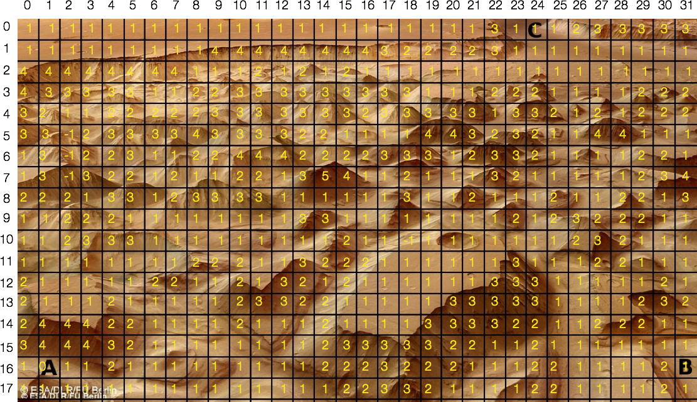
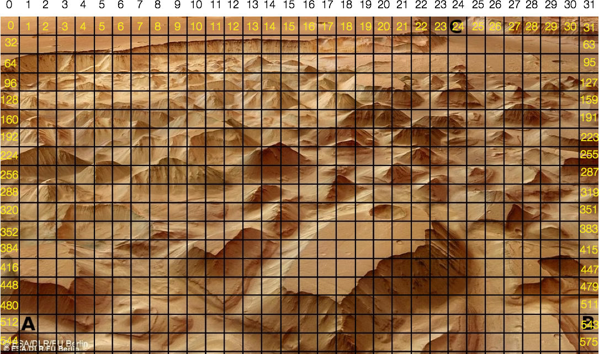
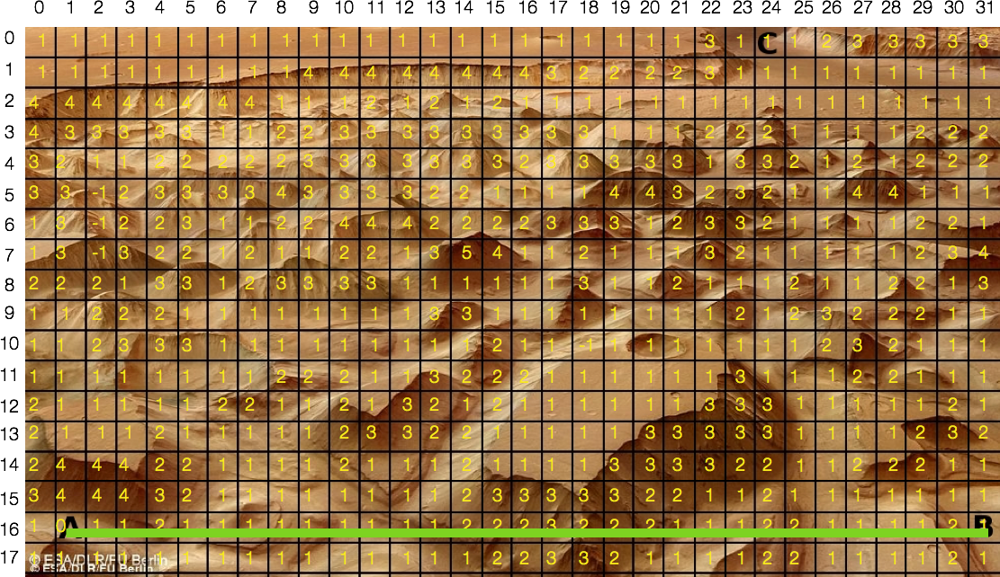
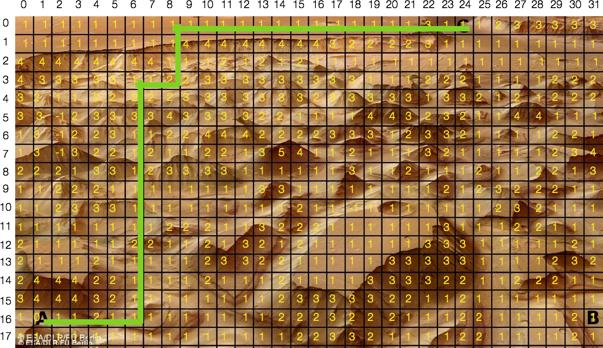

# EECS 3401 ASSIGNMENT 3 SOLUTIONS
**Deadline:** March. 30, 2016  
**Student:** Skyler Layne (cse23170, 212166906)  

\newpage

# PROBLEM 1: Planner

The `planner` file has not been modified for this project, for this reason I
have chosen to omit it. However, the `eats` file has been modified and is available below.

``` prolog
% Initial State, dynamic definitions
:- dynamic(closed/1).
:- dynamic(opened/1).
:- dynamic(cl/1).
:- dynamic(in/2).
:- dynamic(not_hungry/0).
:- dynamic(has/1).
:- dynamic(baked/1).

closed(ref).
closed(mo).
cl(mo).
in(book, ref).
in(pizza, ref).
in(chicken, ref).

% Actions
open(X) :- closed(X), assert(opened(X)), 
  retract(closed(X)), !. 

h_close(X) :- opened(X), assert(closed(X)), 
  retract(opened(X)), !.  

take(X, From) :- cl(From), opened(From), in(X, From), 
  assert(has(X)), retract(in(X, From)), !.

putIn(C,In) :- cl(In), has(C), opened(In), assert(in(C,In)), 
  retract(has(C)), !.

bake(X) :- has(X), closed(mo), assert(baked(X)), 
  retract(has(X)), !.

eat(X) :- not(not_hungry), baked(X), opened(mo), 
  assert(not_hungry), retract(opened(mo)), !.

move(To) :- assert(cl(To)), !.

% Action definitions for "eat" planning scenario

% Action: open(X).
can(open(X),[cl(X),closed(X)]):-appliance(X).
% Facts that become true after executing the Action.
add(open(X),[opened(X)]). 
% Facts the become false after executing the Action.
del(open(X),[closed(X)]). 

% Action: close(X).
can(close(X),[cl(X),opened(X)]):-appliance(X).
add(close(X),[closed(X)]). 
del(close(X),[opened(X)]). 

% Action: take(X, From).
can(take(X,From),[cl(From),opened(From),in(X, From)]):-appliance(From).
add(take(X,From),[has(X), closed(From)]). 
del(take(X,From),[in(X,From), opened(From)]). 

% Action: put(C,In).
can(put(C,In),[cl(In),has(C),opened(In)]):-appliance(In).
add(put(C,In),[in(C,In)]). 
del(put(C,In),[has(C)]). 

% Action: bake(X).
can(bake(X),[cl(mo),has(X),closed(mo)]):-appliance(From), food(X).
add(bake(X),[baked(X), in(X, mo)]). 
del(bake(X),[has(X)]).

% Action: eat(X).
can(eat(X),[has(X), baked(X)]) :- food(X).
add(eat(X),[not_hungry]).
del(eat(X),[has(X)]).

%% Action: move(To).
can(move(To),[cl(X)]):-appliance(To).
add(move(To),[cl(To)]). 
del(move(To),[cl(X)]).
 
appliance(mo).
appliance(ref).
food(chicken).
food(pizza).

:- include('planner').

% Test
% Run the test: plan([closed(ref), closed(mo), cl(mo),in(book,ref), in(pizza, ref), 
  in(chicken,ref)],[not_hungry],Plan,X).

:- write("RUN -- plan([closed(ref), closed(mo), cl(mo), in(book, ref), in(pizza, ref), 
  in(chicken, ref)], [not_hungry], Plan, X) -- TO GET A PLAN").
```
Snippet 1: Eats

\newpage

# PROBLEM 2: Mars

I have chosen to implement `A*` in Java, the following implementation expresses
the definition. I have chosen to flatten the Map into a linear data structure,
in this case we use `ArrayList` to store the cost of each node in the graph. We
also define a `Map` to store the adjacency matrix where the key is a given
node in the graph, and the value is a list of reachable nodes. A pictorial
representation shows the indexes of the data structure. The definition of the definition
can be viewed in Snippet 4.

## Mars Occupancy Grid

At this point there are no obstacles, only points which are more difficult to navigate. The scale ranges from 0-5, where 0 is the starting point, 5 is the most difficult terrain to navigate.  
  

  

  
## Mars Data Structure

Position `A` is represented by the index 513, `B` by the index 543, and `C` by the
index 24.  
  
  
  
\newpage

## Implementation
  
The Java code below shows a class with a private method
`createPath()` invoked from the constructor, this method defines the greedy
algorithm used in `A*` to calculate the shortest path. 

Within the same class, a method `admissibleHeuistic()` is also defined.
It only gets called when the constructor is passed a boolean to determine if
the calculation should be done admissibly or not. This method returns a calculation
of the Manhattan distance from the current index within the search to the final
index of the goal. The Manhattan distance is a commonly used approximation of
the distance left to travel. It is admissible due to the fact that it assumes
each node on the graph has a cost association of 1, therefore it never over
estimates.

On the other hand, when the boolean flag is set to false, a non-admissible search
strategy is used. It estimates that with every choice, the cost of the remaining
path as each node having the same cost of the current node.

To do these calculation I have implemented a `Node` class which represents each
of the nodes in the graph. It holds the index of the node as well as the cost
associated with that node. These nodes are stored in a Priority Queue and as
stored based upon the cost of choosing that node.

## Results
  
After executing the code, we receive the following arrays:

```
Admissible Path from A to B: 
	[513, 514, 515, 516, 517, 518, 519, 520, 521, 522, 523, 524, 525, 526, 527, 528, 529, 530, 531, 532, 533, 534, 535, 536, 537, 538, 539, 540, 541, 542]
	Cost of path: 41

Nonadmissible Path from A to B: 
	[513, 514, 515, 516, 517, 518, 519, 520, 521, 522, 523, 524, 525, 526, 527, 528, 529, 530, 531, 532, 533, 534, 535, 536, 537, 538, 539, 540, 541, 542]
	Cost of path: 41

Admissible Path from A to C: 
	[513, 514, 515, 516, 517, 518, 486, 454, 422, 390, 358, 326, 294, 262, 230, 166, 134, 102, 103, 104, 72, 40, 8, 9, 10, 11, 12, 13, 14, 15, 16, 17, 18, 19, 20, 21, 22, 23]
	Cost of path: 45

Nonadmissible Path from A to C: 
	[513, 514, 515, 516, 517, 518, 486, 454, 422, 390, 358, 326, 294, 262, 230, 166, 134, 102, 103, 104, 72, 40, 8, 9, 10, 11, 12, 13, 14, 15, 16, 17, 18, 19, 20, 21, 22, 23]
	Cost of path: 45
```

The results to both the admissible and non admissible are the same in this case as the optimal decision for each region is a choice of 1. This results in the following paths:

### Path Traversal from A to B


\newpage

### Path Traversal from A to C


\newpage

## The Code
``` java
pacckage astar;

import java.util.ArrayList;
import java.util.Collections;
import java.util.List;
import java.util.Map;
import java.util.PriorityQueue;

/**
 * Definition of a path, the path is calculated with a heuristic function.
 * 
 * @author Skyler Layne, 2016
 *
 */
public class Path {

	// The index to start.
	private int start;

	// The index to end.
	private int end;

	// The cost of taking the path.
	private int value;

	// The graph to be traversed.
	private List<Integer> graph;

	// adjacent matrix, for determining reachable nodes.
	private Map<Integer, List<Integer>> adjacent;

	// Weights stores the wait which is meant to reach that index. [g(n)]
	private List<Integer> weights;

	// Indexes in arrows refers to the node which lead to the visit/
	private List<Integer> arrows;

	// The path to be taken.
	private List<Integer> path;

	private Boolean admissible;

	/**
	 * Create a path object.
	 * 
	 * @param graph
	 * @param adjacent
	 * @param start
	 * @param end
	 */
	public Path(Boolean admissible, List<Integer> graph, Map<Integer, List<Integer>> adjacent, int start, int end) {
		this.admissible = admissible;
		this.graph = graph;
		this.adjacent = adjacent;
		this.start = start;
		this.end = end;
		this.weights = new ArrayList<Integer>(Collections.nCopies(graph.size(), -1));
		this.arrows = new ArrayList<Integer>(Collections.nCopies(graph.size(), -1));
		this.path = this.createPath();
		this.value = 0;
		for (Integer i : path) {
			this.value += graph.get(i);
		}
	}

	/**
	 * Gets a list of indexes which represent the path. Uses the Manhattan
	 * distance.
	 * 
	 * @return
	 */
	private List<Integer> createPath() {

		// The solution path to be constructed.
		List<Integer> solution = new ArrayList<Integer>();

		// PriorityQueue keeps track of the most optimal choice.
		PriorityQueue<Node> pq = new PriorityQueue<Node>();

		// No cost associated with the start node.
		weights.set(start, 0);

		// Create a node on the start node and add it to the PriorityQueue.
		Node n = new Node(start, 0);
		pq.add(n);

		// Index of the last node to be processed
		Integer finalIndex = 0;

		// Loop through the PriorityQueue.
		while (pq.size() > 0) {

			// The the first node off the PriorityQueue
			Node current = pq.poll();

			// Update the index of the current node.
			Integer currentIndex = current.getIndex();

			// Check if we've reached the end.
			if (currentIndex.equals(end)) {
				break;
			}

			// Get a list of the adjacent nodes, loop over all the adjacent
			// nodes
			List<Integer> adjacentNodes = adjacent.get(currentIndex);
			for (Integer index : adjacentNodes) {

				// Calculate the cost of that node.
				Integer cost = weights.get(currentIndex) + graph.get(index);
				float calc = 0;

				// Check if we should process the node.
				boolean process = cost < weights.get(index) || weights.get(index) == -1;
				if (process) {
					// drop an arrow
					arrows.set(index, currentIndex);

					// Update the weight associated with this choice, calculate
					// the cost of that decision, add it to the PriorityQueue.
					weights.set(index, cost);

					// Use admissible Heuristic if desired.
					if (admissible) {
						calc = cost + admissibleHeuristic(index, end);
					} else {
            calc = cost * Math.abs(end - index);
					}

					Node other = new Node(index, calc);
					pq.add(other);
					finalIndex = index;
				}

			} // end adjacent loop

		} // end loops

		// Create the path:
		do

		{
			finalIndex = arrows.get(finalIndex);
			solution.add(finalIndex);
		} while (finalIndex != start);
		Collections.reverse(solution);
		return solution;
	}

	/**
	 * Get the array of paths from leading from end to start.
	 * 
	 * @return - the path.
	 */
	public List<Integer> getPath() {
		return this.path;
	}

	/**
	 * Get the value of the path.
	 * 
	 * @return - the path value.
	 */
	public int getValue() {
		return this.value;
	}

	private float admissibleHeuristic(double index, double end) {
    return (float) Math.sqrt(Math.abs(end - index));
	}

}
```
**Snippet 2**: Algorithm

``` java
package astar;

/**
 * Definition of a Single Node in a graph.
 * 
 * @author Skyler Layne, 2016
 *
 */
public class Node implements Comparable<Object> {
	private Integer index;
	private float weight;

	public Node(Integer index, float weight) {
		this.setIndex(index);
		this.weight = weight;
	}

	@Override
	public String toString() {
		return "[NODE] -- " + "INDEX: " + index + " WEIGHT: " + weight;
	}

	@Override
	public int compareTo(Object o) {
		Node other = (Node) o;

		float a = this.weight;
		float b = other.weight;

		if (a > b)
			return 1;
		if (a < b)
			return -1;
		return 0;
	}

	public Integer getIndex() {
		return index;
	}

	public void setIndex(Integer index) {
		this.index = index;
	}
}
```
**Snippet 3**: Helper

``` java

ckage main;

import java.util.ArrayList;
import java.util.Arrays;
import java.util.HashMap;
import java.util.List;
import java.util.Map;

import astar.Path;

/**
 * Find the Path threw the Mars terrain defined.
 * 
 * @author Skyler Layne, 2016
 *
 */
public class Main {

	public static void main(String[] args) {

		/* Mars Node Cost */
		List<Integer> graph = new ArrayList<Integer>(Arrays.asList(1, 1, 1, 1, 1, 1, 1, 1, 1, 1, 1, 1, 1, 1, 1, 1, 1, 1,
				1, 1, 1, 1, 3, 1, 1, 1, 2, 3, 3, 3, 3, 3, 1, 1, 1, 1, 1, 1, 1, 1, 1, 4, 4, 4, 4, 4, 4, 4, 4, 3, 2, 2, 2,
				2, 3, 1, 1, 1, 1, 1, 1, 1, 1, 1, 4, 4, 4, 4, 4, 4, 4, 4, 1, 1, 1, 2, 1, 2, 1, 2, 1, 1, 1, 1, 1, 1, 1, 1,
				1, 1, 1, 1, 1, 1, 1, 1, 4, 3, 3, 3, 3, 3, 1, 1, 2, 2, 3, 3, 3, 3, 3, 3, 3, 3, 3, 1, 1, 1, 2, 2, 2, 1, 1,
				1, 1, 2, 2, 2, 3, 2, 1, 1, 2, 2, 2, 2, 2, 3, 3, 3, 3, 3, 3, 3, 2, 3, 3, 3, 3, 3, 1, 3, 3, 2, 1, 2, 1, 2,
				2, 2, 3, 3, 2, 2, 3, 3, 3, 3, 4, 3, 3, 3, 3, 2, 2, 1, 1, 1, 1, 4, 4, 3, 2, 3, 2, 1, 1, 4, 4, 1, 1, 1, 1,
				3, 3, 2, 2, 3, 1, 1, 2, 2, 4, 4, 4, 2, 2, 2, 2, 3, 3, 3, 1, 2, 3, 3, 2, 1, 1, 1, 1, 2, 2, 1, 1, 3, 3, 3,
				2, 2, 1, 2, 1, 1, 2, 2, 1, 3, 5, 4, 1, 1, 2, 1, 1, 1, 3, 2, 1, 1, 1, 1, 1, 2, 3, 4, 2, 2, 2, 1, 3, 3, 1,
				2, 3, 3, 3, 3, 1, 1, 1, 1, 1, 1, 3, 1, 1, 2, 1, 1, 1, 2, 1, 1, 2, 2, 1, 3, 1, 1, 2, 2, 2, 1, 1, 1, 1, 1,
				1, 1, 1, 3, 3, 1, 1, 1, 1, 1, 1, 1, 1, 2, 1, 2, 3, 2, 2, 2, 1, 1, 1, 1, 2, 3, 3, 3, 1, 1, 1, 1, 1, 1, 1,
				1, 1, 2, 1, 1, 1, 1, 1, 1, 1, 1, 1, 1, 2, 3, 2, 1, 1, 1, 1, 1, 1, 1, 1, 1, 1, 1, 2, 2, 2, 1, 1, 3, 2, 2,
				2, 1, 1, 1, 1, 1, 1, 3, 1, 1, 1, 2, 2, 1, 1, 1, 2, 1, 1, 1, 1, 1, 2, 2, 1, 1, 2, 1, 3, 2, 1, 2, 1, 1, 1,
				1, 1, 1, 3, 3, 3, 1, 1, 1, 1, 1, 2, 1, 2, 1, 1, 1, 2, 1, 1, 1, 1, 1, 2, 3, 3, 2, 2, 1, 1, 1, 1, 1, 3, 3,
				3, 3, 3, 1, 1, 1, 1, 2, 3, 2, 2, 4, 4, 4, 2, 2, 1, 1, 1, 1, 2, 1, 1, 1, 2, 1, 1, 1, 1, 3, 3, 3, 3, 2, 2,
				1, 1, 2, 2, 2, 1, 1, 3, 4, 4, 4, 3, 2, 1, 1, 1, 1, 1, 1, 1, 1, 2, 3, 3, 3, 3, 3, 2, 2, 1, 1, 2, 1, 1, 1,
				1, 1, 1, 1, 1, 0, 1, 1, 2, 1, 1, 1, 1, 1, 1, 1, 1, 1, 2, 2, 2, 3, 2, 2, 2, 1, 1, 1, 2, 2, 1, 1, 1, 1, 2,
				1, 1, 1, 1, 1, 1, 1, 1, 1, 1, 1, 1, 1, 1, 1, 1, 2, 2, 3, 3, 2, 1, 1, 1, 1, 2, 2, 1, 1, 1, 1, 2, 1));

		/* Mars Adjacency Matrix */
		Map<Integer, List<Integer>> adjacent = new HashMap<Integer, List<Integer>>();

		/* ROW 0 */
		adjacent.put(0, new ArrayList<Integer>(Arrays.asList(1, 32)));
		adjacent.put(1, new ArrayList<Integer>(Arrays.asList(9, 2, 33)));
		adjacent.put(2, new ArrayList<Integer>(Arrays.asList(1, 3, 34)));
		adjacent.put(3, new ArrayList<Integer>(Arrays.asList(2, 4, 35)));
		adjacent.put(4, new ArrayList<Integer>(Arrays.asList(3, 5, 36)));
		adjacent.put(5, new ArrayList<Integer>(Arrays.asList(4, 6, 37)));
		adjacent.put(6, new ArrayList<Integer>(Arrays.asList(5, 7, 38)));
		adjacent.put(7, new ArrayList<Integer>(Arrays.asList(6, 8, 39)));
		adjacent.put(8, new ArrayList<Integer>(Arrays.asList(7, 9, 40)));
		adjacent.put(9, new ArrayList<Integer>(Arrays.asList(8, 10, 41)));
		adjacent.put(10, new ArrayList<Integer>(Arrays.asList(9, 11, 42)));
		adjacent.put(11, new ArrayList<Integer>(Arrays.asList(10, 12, 43)));
		adjacent.put(12, new ArrayList<Integer>(Arrays.asList(11, 13, 44)));
		adjacent.put(13, new ArrayList<Integer>(Arrays.asList(12, 14, 45)));
		adjacent.put(14, new ArrayList<Integer>(Arrays.asList(13, 15, 46)));
		adjacent.put(15, new ArrayList<Integer>(Arrays.asList(14, 16, 47)));
		adjacent.put(16, new ArrayList<Integer>(Arrays.asList(15, 17, 48)));
		adjacent.put(17, new ArrayList<Integer>(Arrays.asList(16, 18, 49)));
		adjacent.put(18, new ArrayList<Integer>(Arrays.asList(17, 19, 50)));
		adjacent.put(19, new ArrayList<Integer>(Arrays.asList(18, 20, 51)));
		adjacent.put(20, new ArrayList<Integer>(Arrays.asList(19, 21, 52)));
		adjacent.put(21, new ArrayList<Integer>(Arrays.asList(20, 22, 53)));
		adjacent.put(22, new ArrayList<Integer>(Arrays.asList(21, 23, 54)));
		adjacent.put(23, new ArrayList<Integer>(Arrays.asList(22, 24, 55)));
		adjacent.put(24, new ArrayList<Integer>(Arrays.asList(23, 25, 56)));
		adjacent.put(25, new ArrayList<Integer>(Arrays.asList(24, 26, 57)));
		adjacent.put(26, new ArrayList<Integer>(Arrays.asList(25, 27, 58)));
		adjacent.put(27, new ArrayList<Integer>(Arrays.asList(26, 28, 59)));
		adjacent.put(28, new ArrayList<Integer>(Arrays.asList(27, 29, 60)));
		adjacent.put(29, new ArrayList<Integer>(Arrays.asList(28, 30, 61)));
		adjacent.put(30, new ArrayList<Integer>(Arrays.asList(29, 31, 62)));
		adjacent.put(31, new ArrayList<Integer>(Arrays.asList(30, 63)));

		/* ROW 1 */
		adjacent.put(32, new ArrayList<Integer>(Arrays.asList(0, 33, 64)));
		adjacent.put(33, new ArrayList<Integer>(Arrays.asList(1, 32, 34, 65)));
		adjacent.put(34, new ArrayList<Integer>(Arrays.asList(2, 33, 35, 66)));
		adjacent.put(35, new ArrayList<Integer>(Arrays.asList(3, 34, 36, 67)));
		adjacent.put(36, new ArrayList<Integer>(Arrays.asList(4, 35, 37, 68)));
		adjacent.put(37, new ArrayList<Integer>(Arrays.asList(5, 36, 38, 69)));
		adjacent.put(38, new ArrayList<Integer>(Arrays.asList(6, 37, 39, 70)));
		adjacent.put(39, new ArrayList<Integer>(Arrays.asList(7, 38, 40, 71)));
		adjacent.put(40, new ArrayList<Integer>(Arrays.asList(8, 39, 41, 72)));
		adjacent.put(41, new ArrayList<Integer>(Arrays.asList(9, 40, 42, 73)));
		adjacent.put(42, new ArrayList<Integer>(Arrays.asList(10, 41, 43, 74)));
		adjacent.put(43, new ArrayList<Integer>(Arrays.asList(11, 42, 44, 75)));
		adjacent.put(44, new ArrayList<Integer>(Arrays.asList(12, 43, 45, 76)));
		adjacent.put(45, new ArrayList<Integer>(Arrays.asList(13, 44, 46, 77)));
		adjacent.put(46, new ArrayList<Integer>(Arrays.asList(14, 45, 47, 78)));
		adjacent.put(47, new ArrayList<Integer>(Arrays.asList(15, 46, 48, 79)));
		adjacent.put(48, new ArrayList<Integer>(Arrays.asList(16, 47, 49, 80)));
		adjacent.put(49, new ArrayList<Integer>(Arrays.asList(17, 48, 50, 81)));
		adjacent.put(50, new ArrayList<Integer>(Arrays.asList(18, 49, 51, 82)));
		adjacent.put(51, new ArrayList<Integer>(Arrays.asList(19, 50, 52, 83)));
		adjacent.put(52, new ArrayList<Integer>(Arrays.asList(20, 51, 53, 84)));
		adjacent.put(53, new ArrayList<Integer>(Arrays.asList(21, 52, 54, 85)));
		adjacent.put(54, new ArrayList<Integer>(Arrays.asList(22, 53, 55, 86)));
		adjacent.put(55, new ArrayList<Integer>(Arrays.asList(23, 54, 56, 87)));
		adjacent.put(56, new ArrayList<Integer>(Arrays.asList(24, 55, 57, 88)));
		adjacent.put(57, new ArrayList<Integer>(Arrays.asList(25, 56, 58, 89)));
		adjacent.put(58, new ArrayList<Integer>(Arrays.asList(26, 57, 59, 90)));
		adjacent.put(59, new ArrayList<Integer>(Arrays.asList(27, 58, 60, 91)));
		adjacent.put(60, new ArrayList<Integer>(Arrays.asList(28, 59, 61, 92)));
		adjacent.put(61, new ArrayList<Integer>(Arrays.asList(29, 60, 62, 93)));
		adjacent.put(62, new ArrayList<Integer>(Arrays.asList(30, 61, 63, 94)));
		adjacent.put(63, new ArrayList<Integer>(Arrays.asList(31, 62, 95)));

		/* ROW 2 */
		adjacent.put(64, new ArrayList<Integer>(Arrays.asList(32, 65, 96)));
		adjacent.put(65, new ArrayList<Integer>(Arrays.asList(33, 64, 66, 97)));
		adjacent.put(66, new ArrayList<Integer>(Arrays.asList(34, 65, 67, 98)));
		adjacent.put(67, new ArrayList<Integer>(Arrays.asList(35, 66, 68, 99)));
		adjacent.put(68, new ArrayList<Integer>(Arrays.asList(36, 67, 69, 100)));
		adjacent.put(69, new ArrayList<Integer>(Arrays.asList(37, 68, 70, 101)));
		adjacent.put(70, new ArrayList<Integer>(Arrays.asList(38, 69, 71, 102)));
		adjacent.put(71, new ArrayList<Integer>(Arrays.asList(39, 70, 72, 103)));
		adjacent.put(72, new ArrayList<Integer>(Arrays.asList(40, 71, 73, 104)));
		adjacent.put(73, new ArrayList<Integer>(Arrays.asList(41, 72, 74, 105)));
		adjacent.put(74, new ArrayList<Integer>(Arrays.asList(42, 73, 75, 106)));
		adjacent.put(75, new ArrayList<Integer>(Arrays.asList(43, 74, 76, 107)));
		adjacent.put(76, new ArrayList<Integer>(Arrays.asList(44, 75, 77, 108)));
		adjacent.put(77, new ArrayList<Integer>(Arrays.asList(45, 76, 78, 109)));
		adjacent.put(78, new ArrayList<Integer>(Arrays.asList(46, 77, 79, 110)));
		adjacent.put(79, new ArrayList<Integer>(Arrays.asList(47, 78, 80, 111)));
		adjacent.put(80, new ArrayList<Integer>(Arrays.asList(48, 79, 81, 112)));
		adjacent.put(81, new ArrayList<Integer>(Arrays.asList(49, 80, 82, 113)));
		adjacent.put(82, new ArrayList<Integer>(Arrays.asList(50, 81, 83, 114)));
		adjacent.put(83, new ArrayList<Integer>(Arrays.asList(51, 82, 84, 115)));
		adjacent.put(84, new ArrayList<Integer>(Arrays.asList(52, 83, 85, 116)));
		adjacent.put(85, new ArrayList<Integer>(Arrays.asList(53, 84, 86, 117)));
		adjacent.put(86, new ArrayList<Integer>(Arrays.asList(54, 85, 87, 118)));
		adjacent.put(87, new ArrayList<Integer>(Arrays.asList(55, 86, 88, 119)));
		adjacent.put(88, new ArrayList<Integer>(Arrays.asList(56, 87, 89, 120)));
		adjacent.put(89, new ArrayList<Integer>(Arrays.asList(57, 88, 90, 121)));
		adjacent.put(90, new ArrayList<Integer>(Arrays.asList(58, 89, 91, 123)));
		adjacent.put(91, new ArrayList<Integer>(Arrays.asList(59, 90, 92, 124)));
		adjacent.put(92, new ArrayList<Integer>(Arrays.asList(60, 91, 93, 125)));
		adjacent.put(93, new ArrayList<Integer>(Arrays.asList(61, 92, 94, 126)));
		adjacent.put(94, new ArrayList<Integer>(Arrays.asList(62, 93, 95, 127)));
		adjacent.put(95, new ArrayList<Integer>(Arrays.asList(63, 94, 128)));

		/* ROW 3 */
		adjacent.put(96, new ArrayList<Integer>(Arrays.asList(64, 97, 128)));
		adjacent.put(97, new ArrayList<Integer>(Arrays.asList(65, 96, 98, 129)));
		adjacent.put(98, new ArrayList<Integer>(Arrays.asList(66, 97, 99, 130)));
		adjacent.put(99, new ArrayList<Integer>(Arrays.asList(67, 98, 100, 131)));
		adjacent.put(100, new ArrayList<Integer>(Arrays.asList(68, 99, 101, 132)));
		adjacent.put(101, new ArrayList<Integer>(Arrays.asList(69, 100, 101, 133)));
		adjacent.put(102, new ArrayList<Integer>(Arrays.asList(70, 101, 103, 134)));
		adjacent.put(103, new ArrayList<Integer>(Arrays.asList(71, 102, 104, 135)));
		adjacent.put(104, new ArrayList<Integer>(Arrays.asList(72, 103, 105, 136)));
		adjacent.put(105, new ArrayList<Integer>(Arrays.asList(73, 104, 106, 137)));
		adjacent.put(106, new ArrayList<Integer>(Arrays.asList(74, 105, 107, 138)));
		adjacent.put(107, new ArrayList<Integer>(Arrays.asList(75, 106, 108, 139)));
		adjacent.put(108, new ArrayList<Integer>(Arrays.asList(76, 107, 109, 140)));
		adjacent.put(109, new ArrayList<Integer>(Arrays.asList(77, 108, 110, 141)));
		adjacent.put(110, new ArrayList<Integer>(Arrays.asList(78, 109, 111, 142)));
		adjacent.put(111, new ArrayList<Integer>(Arrays.asList(79, 110, 112, 143)));
		adjacent.put(112, new ArrayList<Integer>(Arrays.asList(80, 111, 113, 144)));
		adjacent.put(113, new ArrayList<Integer>(Arrays.asList(81, 112, 114, 145)));
		adjacent.put(114, new ArrayList<Integer>(Arrays.asList(82, 113, 115, 146)));
		adjacent.put(115, new ArrayList<Integer>(Arrays.asList(83, 114, 116, 147)));
		adjacent.put(116, new ArrayList<Integer>(Arrays.asList(84, 115, 117, 148)));
		adjacent.put(117, new ArrayList<Integer>(Arrays.asList(85, 116, 118, 149)));
		adjacent.put(118, new ArrayList<Integer>(Arrays.asList(86, 117, 119, 150)));
		adjacent.put(119, new ArrayList<Integer>(Arrays.asList(87, 118, 120, 151)));
		adjacent.put(120, new ArrayList<Integer>(Arrays.asList(88, 119, 121, 152)));
		adjacent.put(121, new ArrayList<Integer>(Arrays.asList(89, 120, 122, 153)));
		adjacent.put(122, new ArrayList<Integer>(Arrays.asList(90, 121, 123, 154)));
		adjacent.put(123, new ArrayList<Integer>(Arrays.asList(91, 122, 124, 155)));
		adjacent.put(124, new ArrayList<Integer>(Arrays.asList(92, 123, 125, 156)));
		adjacent.put(125, new ArrayList<Integer>(Arrays.asList(93, 124, 126, 157)));
		adjacent.put(126, new ArrayList<Integer>(Arrays.asList(94, 125, 127, 158)));
		adjacent.put(127, new ArrayList<Integer>(Arrays.asList(95, 126, 159)));

		/* ROW 4 */
		adjacent.put(128, new ArrayList<Integer>(Arrays.asList(96, 129, 160)));
		adjacent.put(129, new ArrayList<Integer>(Arrays.asList(97, 128, 130, 161)));
		adjacent.put(130, new ArrayList<Integer>(Arrays.asList(98, 129, 131, 162)));
		adjacent.put(131, new ArrayList<Integer>(Arrays.asList(99, 130, 132, 163)));
		adjacent.put(132, new ArrayList<Integer>(Arrays.asList(100, 131, 133, 164)));
		adjacent.put(133, new ArrayList<Integer>(Arrays.asList(101, 132, 134, 165)));
		adjacent.put(134, new ArrayList<Integer>(Arrays.asList(102, 133, 135, 166)));
		adjacent.put(135, new ArrayList<Integer>(Arrays.asList(103, 134, 136, 167)));
		adjacent.put(136, new ArrayList<Integer>(Arrays.asList(104, 135, 137, 168)));
		adjacent.put(137, new ArrayList<Integer>(Arrays.asList(105, 136, 138, 169)));
		adjacent.put(138, new ArrayList<Integer>(Arrays.asList(106, 137, 139, 170)));
		adjacent.put(139, new ArrayList<Integer>(Arrays.asList(107, 138, 140, 171)));
		adjacent.put(140, new ArrayList<Integer>(Arrays.asList(108, 139, 141, 172)));
		adjacent.put(141, new ArrayList<Integer>(Arrays.asList(109, 140, 142, 173)));
		adjacent.put(142, new ArrayList<Integer>(Arrays.asList(110, 141, 143, 174)));
		adjacent.put(143, new ArrayList<Integer>(Arrays.asList(111, 142, 144, 175)));
		adjacent.put(144, new ArrayList<Integer>(Arrays.asList(112, 143, 145, 176)));
		adjacent.put(145, new ArrayList<Integer>(Arrays.asList(113, 144, 146, 177)));
		adjacent.put(146, new ArrayList<Integer>(Arrays.asList(114, 145, 147, 178)));
		adjacent.put(147, new ArrayList<Integer>(Arrays.asList(115, 146, 148, 179)));
		adjacent.put(148, new ArrayList<Integer>(Arrays.asList(116, 147, 149, 180)));
		adjacent.put(149, new ArrayList<Integer>(Arrays.asList(117, 148, 150, 181)));
		adjacent.put(150, new ArrayList<Integer>(Arrays.asList(118, 149, 151, 182)));
		adjacent.put(151, new ArrayList<Integer>(Arrays.asList(119, 150, 152, 183)));
		adjacent.put(152, new ArrayList<Integer>(Arrays.asList(120, 151, 153, 184)));
		adjacent.put(153, new ArrayList<Integer>(Arrays.asList(121, 152, 154, 185)));
		adjacent.put(154, new ArrayList<Integer>(Arrays.asList(122, 153, 155, 186)));
		adjacent.put(155, new ArrayList<Integer>(Arrays.asList(123, 154, 156, 187)));
		adjacent.put(156, new ArrayList<Integer>(Arrays.asList(124, 155, 157, 188)));
		adjacent.put(157, new ArrayList<Integer>(Arrays.asList(125, 156, 158, 189)));
		adjacent.put(158, new ArrayList<Integer>(Arrays.asList(126, 157, 159, 190)));
		adjacent.put(159, new ArrayList<Integer>(Arrays.asList(127, 158, 191)));

		/* ROW 5 */
		adjacent.put(160, new ArrayList<Integer>(Arrays.asList(128, 161, 192)));
		adjacent.put(161, new ArrayList<Integer>(Arrays.asList(129, 160, 162, 193)));
		adjacent.put(162, new ArrayList<Integer>(Arrays.asList(130, 161, 163, 194)));
		adjacent.put(163, new ArrayList<Integer>(Arrays.asList(131, 162, 164, 195)));
		adjacent.put(164, new ArrayList<Integer>(Arrays.asList(132, 163, 165, 196)));
		adjacent.put(165, new ArrayList<Integer>(Arrays.asList(133, 164, 166, 197)));
		adjacent.put(166, new ArrayList<Integer>(Arrays.asList(134, 165, 167, 198)));
		adjacent.put(167, new ArrayList<Integer>(Arrays.asList(135, 166, 168, 199)));
		adjacent.put(168, new ArrayList<Integer>(Arrays.asList(136, 167, 169, 200)));
		adjacent.put(169, new ArrayList<Integer>(Arrays.asList(137, 168, 170, 201)));
		adjacent.put(170, new ArrayList<Integer>(Arrays.asList(138, 169, 171, 202)));
		adjacent.put(171, new ArrayList<Integer>(Arrays.asList(139, 170, 172, 203)));
		adjacent.put(172, new ArrayList<Integer>(Arrays.asList(140, 171, 173, 204)));
		adjacent.put(173, new ArrayList<Integer>(Arrays.asList(141, 172, 174, 205)));
		adjacent.put(174, new ArrayList<Integer>(Arrays.asList(142, 173, 175, 206)));
		adjacent.put(175, new ArrayList<Integer>(Arrays.asList(143, 174, 176, 207)));
		adjacent.put(176, new ArrayList<Integer>(Arrays.asList(144, 175, 177, 208)));
		adjacent.put(177, new ArrayList<Integer>(Arrays.asList(145, 176, 178, 209)));
		adjacent.put(178, new ArrayList<Integer>(Arrays.asList(146, 177, 179, 210)));
		adjacent.put(179, new ArrayList<Integer>(Arrays.asList(147, 178, 180, 211)));
		adjacent.put(180, new ArrayList<Integer>(Arrays.asList(148, 179, 181, 212)));
		adjacent.put(181, new ArrayList<Integer>(Arrays.asList(149, 180, 182, 213)));
		adjacent.put(182, new ArrayList<Integer>(Arrays.asList(150, 181, 183, 214)));
		adjacent.put(183, new ArrayList<Integer>(Arrays.asList(151, 182, 184, 215)));
		adjacent.put(184, new ArrayList<Integer>(Arrays.asList(152, 183, 185, 216)));
		adjacent.put(185, new ArrayList<Integer>(Arrays.asList(153, 184, 186, 217)));
		adjacent.put(186, new ArrayList<Integer>(Arrays.asList(154, 185, 187, 218)));
		adjacent.put(187, new ArrayList<Integer>(Arrays.asList(155, 186, 188, 219)));
		adjacent.put(188, new ArrayList<Integer>(Arrays.asList(156, 187, 189, 220)));
		adjacent.put(189, new ArrayList<Integer>(Arrays.asList(157, 188, 190, 221)));
		adjacent.put(190, new ArrayList<Integer>(Arrays.asList(158, 189, 191, 222)));
		adjacent.put(191, new ArrayList<Integer>(Arrays.asList(159, 190, 223)));

		/* ROW 6 */
		adjacent.put(192, new ArrayList<Integer>(Arrays.asList(160, 193, 224)));
		adjacent.put(193, new ArrayList<Integer>(Arrays.asList(161, 192, 194, 225)));
		adjacent.put(194, new ArrayList<Integer>(Arrays.asList(162, 193, 195, 226)));
		adjacent.put(195, new ArrayList<Integer>(Arrays.asList(163, 194, 196, 227)));
		adjacent.put(196, new ArrayList<Integer>(Arrays.asList(164, 195, 197, 228)));
		adjacent.put(197, new ArrayList<Integer>(Arrays.asList(165, 196, 198, 229)));
		adjacent.put(198, new ArrayList<Integer>(Arrays.asList(166, 197, 199, 230)));
		adjacent.put(199, new ArrayList<Integer>(Arrays.asList(167, 198, 200, 231)));
		adjacent.put(200, new ArrayList<Integer>(Arrays.asList(168, 199, 201, 232)));
		adjacent.put(201, new ArrayList<Integer>(Arrays.asList(169, 200, 202, 233)));
		adjacent.put(202, new ArrayList<Integer>(Arrays.asList(170, 201, 203, 234)));
		adjacent.put(203, new ArrayList<Integer>(Arrays.asList(171, 202, 204, 235)));
		adjacent.put(204, new ArrayList<Integer>(Arrays.asList(172, 203, 205, 236)));
		adjacent.put(205, new ArrayList<Integer>(Arrays.asList(173, 204, 206, 237)));
		adjacent.put(206, new ArrayList<Integer>(Arrays.asList(174, 205, 207, 238)));
		adjacent.put(207, new ArrayList<Integer>(Arrays.asList(175, 206, 208, 239)));
		adjacent.put(208, new ArrayList<Integer>(Arrays.asList(176, 207, 209, 240)));
		adjacent.put(209, new ArrayList<Integer>(Arrays.asList(177, 208, 210, 241)));
		adjacent.put(210, new ArrayList<Integer>(Arrays.asList(178, 209, 211, 242)));
		adjacent.put(211, new ArrayList<Integer>(Arrays.asList(179, 210, 212, 243)));
		adjacent.put(212, new ArrayList<Integer>(Arrays.asList(180, 211, 213, 244)));
		adjacent.put(213, new ArrayList<Integer>(Arrays.asList(181, 212, 214, 245)));
		adjacent.put(214, new ArrayList<Integer>(Arrays.asList(182, 213, 215, 246)));
		adjacent.put(215, new ArrayList<Integer>(Arrays.asList(183, 214, 216, 247)));
		adjacent.put(216, new ArrayList<Integer>(Arrays.asList(184, 215, 217, 248)));
		adjacent.put(217, new ArrayList<Integer>(Arrays.asList(185, 216, 218, 249)));
		adjacent.put(218, new ArrayList<Integer>(Arrays.asList(186, 217, 219, 250)));
		adjacent.put(219, new ArrayList<Integer>(Arrays.asList(187, 218, 220, 251)));
		adjacent.put(220, new ArrayList<Integer>(Arrays.asList(188, 219, 221, 252)));
		adjacent.put(221, new ArrayList<Integer>(Arrays.asList(189, 220, 222, 253)));
		adjacent.put(222, new ArrayList<Integer>(Arrays.asList(190, 221, 223, 254)));
		adjacent.put(223, new ArrayList<Integer>(Arrays.asList(191, 222, 255)));

		/* ROW 7 */
		adjacent.put(224, new ArrayList<Integer>(Arrays.asList(160, 225, 256)));
		adjacent.put(225, new ArrayList<Integer>(Arrays.asList(161, 224, 226, 257)));
		adjacent.put(226, new ArrayList<Integer>(Arrays.asList(162, 225, 227, 258)));
		adjacent.put(227, new ArrayList<Integer>(Arrays.asList(163, 226, 228, 259)));
		adjacent.put(228, new ArrayList<Integer>(Arrays.asList(164, 227, 229, 260)));
		adjacent.put(229, new ArrayList<Integer>(Arrays.asList(165, 228, 230, 261)));
		adjacent.put(230, new ArrayList<Integer>(Arrays.asList(166, 229, 231, 262)));
		adjacent.put(231, new ArrayList<Integer>(Arrays.asList(167, 230, 232, 263)));
		adjacent.put(232, new ArrayList<Integer>(Arrays.asList(168, 231, 233, 264)));
		adjacent.put(233, new ArrayList<Integer>(Arrays.asList(169, 232, 234, 265)));
		adjacent.put(234, new ArrayList<Integer>(Arrays.asList(170, 233, 235, 266)));
		adjacent.put(235, new ArrayList<Integer>(Arrays.asList(171, 234, 236, 267)));
		adjacent.put(236, new ArrayList<Integer>(Arrays.asList(172, 235, 237, 268)));
		adjacent.put(237, new ArrayList<Integer>(Arrays.asList(173, 236, 238, 269)));
		adjacent.put(238, new ArrayList<Integer>(Arrays.asList(174, 237, 239, 270)));
		adjacent.put(239, new ArrayList<Integer>(Arrays.asList(175, 238, 240, 271)));
		adjacent.put(240, new ArrayList<Integer>(Arrays.asList(176, 239, 241, 272)));
		adjacent.put(241, new ArrayList<Integer>(Arrays.asList(177, 240, 242, 273)));
		adjacent.put(242, new ArrayList<Integer>(Arrays.asList(178, 241, 243, 274)));
		adjacent.put(243, new ArrayList<Integer>(Arrays.asList(179, 242, 244, 275)));
		adjacent.put(244, new ArrayList<Integer>(Arrays.asList(180, 243, 245, 276)));
		adjacent.put(245, new ArrayList<Integer>(Arrays.asList(181, 244, 246, 277)));
		adjacent.put(246, new ArrayList<Integer>(Arrays.asList(182, 245, 247, 278)));
		adjacent.put(247, new ArrayList<Integer>(Arrays.asList(183, 246, 248, 279)));
		adjacent.put(248, new ArrayList<Integer>(Arrays.asList(184, 247, 249, 280)));
		adjacent.put(249, new ArrayList<Integer>(Arrays.asList(185, 248, 250, 281)));
		adjacent.put(250, new ArrayList<Integer>(Arrays.asList(186, 249, 251, 282)));
		adjacent.put(251, new ArrayList<Integer>(Arrays.asList(187, 250, 252, 283)));
		adjacent.put(252, new ArrayList<Integer>(Arrays.asList(188, 251, 253, 284)));
		adjacent.put(253, new ArrayList<Integer>(Arrays.asList(189, 252, 254, 285)));
		adjacent.put(254, new ArrayList<Integer>(Arrays.asList(190, 253, 255, 286)));
		adjacent.put(255, new ArrayList<Integer>(Arrays.asList(191, 254, 287)));

		/* ROW 8 */
		adjacent.put(256, new ArrayList<Integer>(Arrays.asList(224, 257, 288)));
		adjacent.put(257, new ArrayList<Integer>(Arrays.asList(225, 256, 258, 289)));
		adjacent.put(258, new ArrayList<Integer>(Arrays.asList(226, 257, 259, 290)));
		adjacent.put(259, new ArrayList<Integer>(Arrays.asList(227, 258, 260, 291)));
		adjacent.put(260, new ArrayList<Integer>(Arrays.asList(228, 259, 261, 292)));
		adjacent.put(261, new ArrayList<Integer>(Arrays.asList(229, 260, 262, 293)));
		adjacent.put(262, new ArrayList<Integer>(Arrays.asList(230, 261, 263, 294)));
		adjacent.put(263, new ArrayList<Integer>(Arrays.asList(231, 262, 264, 295)));
		adjacent.put(264, new ArrayList<Integer>(Arrays.asList(232, 263, 265, 296)));
		adjacent.put(265, new ArrayList<Integer>(Arrays.asList(233, 264, 266, 297)));
		adjacent.put(266, new ArrayList<Integer>(Arrays.asList(234, 265, 267, 298)));
		adjacent.put(267, new ArrayList<Integer>(Arrays.asList(235, 266, 268, 299)));
		adjacent.put(268, new ArrayList<Integer>(Arrays.asList(236, 267, 269, 300)));
		adjacent.put(269, new ArrayList<Integer>(Arrays.asList(237, 268, 270, 301)));
		adjacent.put(270, new ArrayList<Integer>(Arrays.asList(238, 269, 271, 302)));
		adjacent.put(271, new ArrayList<Integer>(Arrays.asList(239, 270, 272, 303)));
		adjacent.put(272, new ArrayList<Integer>(Arrays.asList(240, 271, 273, 304)));
		adjacent.put(273, new ArrayList<Integer>(Arrays.asList(241, 272, 274, 305)));
		adjacent.put(274, new ArrayList<Integer>(Arrays.asList(242, 273, 275, 306)));
		adjacent.put(275, new ArrayList<Integer>(Arrays.asList(243, 274, 276, 307)));
		adjacent.put(276, new ArrayList<Integer>(Arrays.asList(244, 275, 277, 308)));
		adjacent.put(277, new ArrayList<Integer>(Arrays.asList(245, 276, 278, 309)));
		adjacent.put(278, new ArrayList<Integer>(Arrays.asList(246, 277, 279, 310)));
		adjacent.put(279, new ArrayList<Integer>(Arrays.asList(247, 278, 280, 311)));
		adjacent.put(280, new ArrayList<Integer>(Arrays.asList(248, 279, 281, 312)));
		adjacent.put(281, new ArrayList<Integer>(Arrays.asList(249, 280, 282, 313)));
		adjacent.put(282, new ArrayList<Integer>(Arrays.asList(250, 281, 283, 314)));
		adjacent.put(283, new ArrayList<Integer>(Arrays.asList(251, 282, 284, 315)));
		adjacent.put(284, new ArrayList<Integer>(Arrays.asList(252, 283, 285, 316)));
		adjacent.put(285, new ArrayList<Integer>(Arrays.asList(253, 284, 286, 317)));
		adjacent.put(286, new ArrayList<Integer>(Arrays.asList(254, 285, 287, 318)));
		adjacent.put(287, new ArrayList<Integer>(Arrays.asList(255, 286, 319)));

		/* ROW 9 */
		adjacent.put(288, new ArrayList<Integer>(Arrays.asList(256, 289, 320)));
		adjacent.put(289, new ArrayList<Integer>(Arrays.asList(257, 288, 290, 321)));
		adjacent.put(290, new ArrayList<Integer>(Arrays.asList(258, 289, 291, 322)));
		adjacent.put(291, new ArrayList<Integer>(Arrays.asList(259, 290, 292, 323)));
		adjacent.put(292, new ArrayList<Integer>(Arrays.asList(260, 291, 293, 324)));
		adjacent.put(293, new ArrayList<Integer>(Arrays.asList(261, 292, 294, 325)));
		adjacent.put(294, new ArrayList<Integer>(Arrays.asList(262, 293, 295, 326)));
		adjacent.put(295, new ArrayList<Integer>(Arrays.asList(263, 294, 296, 327)));
		adjacent.put(296, new ArrayList<Integer>(Arrays.asList(264, 295, 297, 328)));
		adjacent.put(297, new ArrayList<Integer>(Arrays.asList(265, 296, 298, 329)));
		adjacent.put(298, new ArrayList<Integer>(Arrays.asList(266, 297, 299, 330)));
		adjacent.put(299, new ArrayList<Integer>(Arrays.asList(267, 298, 300, 331)));
		adjacent.put(300, new ArrayList<Integer>(Arrays.asList(268, 299, 301, 332)));
		adjacent.put(301, new ArrayList<Integer>(Arrays.asList(269, 300, 302, 333)));
		adjacent.put(302, new ArrayList<Integer>(Arrays.asList(270, 301, 303, 334)));
		adjacent.put(303, new ArrayList<Integer>(Arrays.asList(271, 302, 304, 335)));
		adjacent.put(304, new ArrayList<Integer>(Arrays.asList(272, 303, 305, 336)));
		adjacent.put(305, new ArrayList<Integer>(Arrays.asList(273, 304, 306, 337)));
		adjacent.put(306, new ArrayList<Integer>(Arrays.asList(274, 305, 306, 338)));
		adjacent.put(307, new ArrayList<Integer>(Arrays.asList(275, 306, 308, 339)));
		adjacent.put(308, new ArrayList<Integer>(Arrays.asList(276, 307, 309, 340)));
		adjacent.put(309, new ArrayList<Integer>(Arrays.asList(277, 308, 310, 341)));
		adjacent.put(310, new ArrayList<Integer>(Arrays.asList(278, 309, 311, 342)));
		adjacent.put(311, new ArrayList<Integer>(Arrays.asList(279, 310, 312, 343)));
		adjacent.put(312, new ArrayList<Integer>(Arrays.asList(280, 311, 313, 344)));
		adjacent.put(313, new ArrayList<Integer>(Arrays.asList(281, 312, 314, 345)));
		adjacent.put(314, new ArrayList<Integer>(Arrays.asList(282, 313, 315, 346)));
		adjacent.put(315, new ArrayList<Integer>(Arrays.asList(283, 314, 316, 347)));
		adjacent.put(316, new ArrayList<Integer>(Arrays.asList(284, 315, 317, 348)));
		adjacent.put(317, new ArrayList<Integer>(Arrays.asList(285, 316, 318, 349)));
		adjacent.put(318, new ArrayList<Integer>(Arrays.asList(286, 317, 319, 350)));
		adjacent.put(319, new ArrayList<Integer>(Arrays.asList(287, 318, 351)));

		/* ROW 10 */
		adjacent.put(320, new ArrayList<Integer>(Arrays.asList(288, 321, 352)));
		adjacent.put(321, new ArrayList<Integer>(Arrays.asList(289, 320, 322, 353)));
		adjacent.put(322, new ArrayList<Integer>(Arrays.asList(290, 321, 323, 354)));
		adjacent.put(323, new ArrayList<Integer>(Arrays.asList(291, 322, 324, 355)));
		adjacent.put(324, new ArrayList<Integer>(Arrays.asList(292, 323, 325, 356)));
		adjacent.put(325, new ArrayList<Integer>(Arrays.asList(293, 324, 326, 357)));
		adjacent.put(326, new ArrayList<Integer>(Arrays.asList(294, 325, 327, 358)));
		adjacent.put(327, new ArrayList<Integer>(Arrays.asList(295, 326, 328, 359)));
		adjacent.put(328, new ArrayList<Integer>(Arrays.asList(296, 327, 329, 360)));
		adjacent.put(329, new ArrayList<Integer>(Arrays.asList(297, 328, 330, 361)));
		adjacent.put(330, new ArrayList<Integer>(Arrays.asList(298, 329, 331, 362)));
		adjacent.put(331, new ArrayList<Integer>(Arrays.asList(299, 330, 332, 363)));
		adjacent.put(332, new ArrayList<Integer>(Arrays.asList(300, 331, 333, 364)));
		adjacent.put(333, new ArrayList<Integer>(Arrays.asList(301, 332, 334, 365)));
		adjacent.put(334, new ArrayList<Integer>(Arrays.asList(302, 333, 335, 366)));
		adjacent.put(335, new ArrayList<Integer>(Arrays.asList(303, 334, 336, 367)));
		adjacent.put(336, new ArrayList<Integer>(Arrays.asList(304, 335, 337, 368)));
		adjacent.put(337, new ArrayList<Integer>(Arrays.asList(305, 336, 338, 369)));
		adjacent.put(338, new ArrayList<Integer>(Arrays.asList(306, 337, 339, 370)));
		adjacent.put(339, new ArrayList<Integer>(Arrays.asList(307, 338, 340, 371)));
		adjacent.put(340, new ArrayList<Integer>(Arrays.asList(308, 339, 341, 372)));
		adjacent.put(341, new ArrayList<Integer>(Arrays.asList(309, 340, 342, 373)));
		adjacent.put(342, new ArrayList<Integer>(Arrays.asList(310, 341, 343, 374)));
		adjacent.put(343, new ArrayList<Integer>(Arrays.asList(311, 342, 344, 375)));
		adjacent.put(344, new ArrayList<Integer>(Arrays.asList(312, 343, 345, 376)));
		adjacent.put(345, new ArrayList<Integer>(Arrays.asList(313, 344, 346, 377)));
		adjacent.put(346, new ArrayList<Integer>(Arrays.asList(314, 345, 347, 378)));
		adjacent.put(347, new ArrayList<Integer>(Arrays.asList(315, 346, 348, 379)));
		adjacent.put(348, new ArrayList<Integer>(Arrays.asList(316, 347, 349, 380)));
		adjacent.put(349, new ArrayList<Integer>(Arrays.asList(317, 348, 350, 381)));
		adjacent.put(350, new ArrayList<Integer>(Arrays.asList(318, 349, 351, 382)));
		adjacent.put(351, new ArrayList<Integer>(Arrays.asList(319, 350, 383)));

		/* ROW 11 */
		adjacent.put(352, new ArrayList<Integer>(Arrays.asList(320, 353, 384)));
		adjacent.put(353, new ArrayList<Integer>(Arrays.asList(321, 352, 354, 385)));
		adjacent.put(354, new ArrayList<Integer>(Arrays.asList(322, 353, 355, 386)));
		adjacent.put(355, new ArrayList<Integer>(Arrays.asList(323, 354, 356, 387)));
		adjacent.put(356, new ArrayList<Integer>(Arrays.asList(324, 355, 357, 388)));
		adjacent.put(357, new ArrayList<Integer>(Arrays.asList(325, 356, 358, 389)));
		adjacent.put(358, new ArrayList<Integer>(Arrays.asList(326, 357, 359, 390)));
		adjacent.put(359, new ArrayList<Integer>(Arrays.asList(327, 358, 360, 391)));
		adjacent.put(360, new ArrayList<Integer>(Arrays.asList(328, 359, 361, 392)));
		adjacent.put(361, new ArrayList<Integer>(Arrays.asList(329, 360, 362, 393)));
		adjacent.put(362, new ArrayList<Integer>(Arrays.asList(330, 361, 363, 394)));
		adjacent.put(363, new ArrayList<Integer>(Arrays.asList(331, 362, 364, 395)));
		adjacent.put(364, new ArrayList<Integer>(Arrays.asList(332, 363, 365, 396)));
		adjacent.put(365, new ArrayList<Integer>(Arrays.asList(333, 364, 366, 397)));
		adjacent.put(366, new ArrayList<Integer>(Arrays.asList(334, 365, 367, 398)));
		adjacent.put(367, new ArrayList<Integer>(Arrays.asList(335, 366, 368, 399)));
		adjacent.put(368, new ArrayList<Integer>(Arrays.asList(336, 367, 369, 400)));
		adjacent.put(369, new ArrayList<Integer>(Arrays.asList(337, 368, 370, 401)));
		adjacent.put(370, new ArrayList<Integer>(Arrays.asList(338, 369, 371, 402)));
		adjacent.put(371, new ArrayList<Integer>(Arrays.asList(339, 370, 372, 403)));
		adjacent.put(372, new ArrayList<Integer>(Arrays.asList(340, 371, 373, 404)));
		adjacent.put(373, new ArrayList<Integer>(Arrays.asList(341, 372, 374, 405)));
		adjacent.put(374, new ArrayList<Integer>(Arrays.asList(342, 373, 375, 406)));
		adjacent.put(375, new ArrayList<Integer>(Arrays.asList(343, 374, 376, 407)));
		adjacent.put(376, new ArrayList<Integer>(Arrays.asList(344, 375, 377, 408)));
		adjacent.put(377, new ArrayList<Integer>(Arrays.asList(345, 376, 378, 409)));
		adjacent.put(378, new ArrayList<Integer>(Arrays.asList(346, 377, 379, 410)));
		adjacent.put(379, new ArrayList<Integer>(Arrays.asList(347, 378, 380, 411)));
		adjacent.put(380, new ArrayList<Integer>(Arrays.asList(348, 379, 381, 412)));
		adjacent.put(381, new ArrayList<Integer>(Arrays.asList(349, 380, 382, 413)));
		adjacent.put(382, new ArrayList<Integer>(Arrays.asList(350, 381, 383, 414)));
		adjacent.put(383, new ArrayList<Integer>(Arrays.asList(351, 382, 415)));

		/* ROW 12 */
		adjacent.put(384, new ArrayList<Integer>(Arrays.asList(352, 385, 416)));
		adjacent.put(385, new ArrayList<Integer>(Arrays.asList(353, 384, 386, 417)));
		adjacent.put(386, new ArrayList<Integer>(Arrays.asList(354, 385, 387, 418)));
		adjacent.put(387, new ArrayList<Integer>(Arrays.asList(355, 386, 388, 419)));
		adjacent.put(388, new ArrayList<Integer>(Arrays.asList(356, 387, 389, 420)));
		adjacent.put(389, new ArrayList<Integer>(Arrays.asList(357, 388, 390, 421)));
		adjacent.put(390, new ArrayList<Integer>(Arrays.asList(358, 389, 391, 422)));
		adjacent.put(391, new ArrayList<Integer>(Arrays.asList(359, 390, 392, 423)));
		adjacent.put(392, new ArrayList<Integer>(Arrays.asList(360, 391, 393, 424)));
		adjacent.put(393, new ArrayList<Integer>(Arrays.asList(361, 392, 394, 425)));
		adjacent.put(394, new ArrayList<Integer>(Arrays.asList(362, 393, 395, 426)));
		adjacent.put(395, new ArrayList<Integer>(Arrays.asList(363, 394, 396, 427)));
		adjacent.put(396, new ArrayList<Integer>(Arrays.asList(364, 395, 397, 428)));
		adjacent.put(397, new ArrayList<Integer>(Arrays.asList(365, 396, 398, 429)));
		adjacent.put(398, new ArrayList<Integer>(Arrays.asList(366, 397, 399, 430)));
		adjacent.put(399, new ArrayList<Integer>(Arrays.asList(367, 398, 400, 431)));
		adjacent.put(400, new ArrayList<Integer>(Arrays.asList(368, 399, 401, 432)));
		adjacent.put(401, new ArrayList<Integer>(Arrays.asList(369, 400, 402, 433)));
		adjacent.put(402, new ArrayList<Integer>(Arrays.asList(370, 401, 403, 434)));
		adjacent.put(403, new ArrayList<Integer>(Arrays.asList(371, 402, 404, 435)));
		adjacent.put(404, new ArrayList<Integer>(Arrays.asList(372, 403, 405, 436)));
		adjacent.put(405, new ArrayList<Integer>(Arrays.asList(373, 404, 406, 437)));
		adjacent.put(406, new ArrayList<Integer>(Arrays.asList(374, 405, 407, 438)));
		adjacent.put(407, new ArrayList<Integer>(Arrays.asList(375, 406, 408, 439)));
		adjacent.put(408, new ArrayList<Integer>(Arrays.asList(376, 407, 409, 440)));
		adjacent.put(409, new ArrayList<Integer>(Arrays.asList(377, 408, 410, 441)));
		adjacent.put(410, new ArrayList<Integer>(Arrays.asList(378, 409, 411, 442)));
		adjacent.put(411, new ArrayList<Integer>(Arrays.asList(379, 410, 412, 443)));
		adjacent.put(412, new ArrayList<Integer>(Arrays.asList(380, 411, 413, 444)));
		adjacent.put(413, new ArrayList<Integer>(Arrays.asList(381, 412, 414, 445)));
		adjacent.put(414, new ArrayList<Integer>(Arrays.asList(382, 413, 415, 446)));
		adjacent.put(415, new ArrayList<Integer>(Arrays.asList(383, 414, 447)));

		/* ROW 13 */
		adjacent.put(416, new ArrayList<Integer>(Arrays.asList(384, 417, 448)));
		adjacent.put(417, new ArrayList<Integer>(Arrays.asList(385, 416, 418, 449)));
		adjacent.put(418, new ArrayList<Integer>(Arrays.asList(386, 417, 419, 450)));
		adjacent.put(419, new ArrayList<Integer>(Arrays.asList(387, 418, 420, 451)));
		adjacent.put(420, new ArrayList<Integer>(Arrays.asList(388, 419, 421, 452)));
		adjacent.put(421, new ArrayList<Integer>(Arrays.asList(389, 420, 422, 453)));
		adjacent.put(422, new ArrayList<Integer>(Arrays.asList(390, 421, 423, 454)));
		adjacent.put(423, new ArrayList<Integer>(Arrays.asList(391, 422, 424, 455)));
		adjacent.put(424, new ArrayList<Integer>(Arrays.asList(392, 423, 425, 456)));
		adjacent.put(425, new ArrayList<Integer>(Arrays.asList(393, 424, 426, 457)));
		adjacent.put(426, new ArrayList<Integer>(Arrays.asList(394, 425, 427, 458)));
		adjacent.put(427, new ArrayList<Integer>(Arrays.asList(395, 426, 428, 459)));
		adjacent.put(428, new ArrayList<Integer>(Arrays.asList(396, 427, 429, 460)));
		adjacent.put(429, new ArrayList<Integer>(Arrays.asList(397, 428, 430, 461)));
		adjacent.put(430, new ArrayList<Integer>(Arrays.asList(398, 429, 431, 462)));
		adjacent.put(431, new ArrayList<Integer>(Arrays.asList(399, 430, 432, 463)));
		adjacent.put(432, new ArrayList<Integer>(Arrays.asList(400, 431, 433, 464)));
		adjacent.put(433, new ArrayList<Integer>(Arrays.asList(401, 432, 434, 465)));
		adjacent.put(434, new ArrayList<Integer>(Arrays.asList(402, 433, 435, 466)));
		adjacent.put(435, new ArrayList<Integer>(Arrays.asList(403, 434, 436, 467)));
		adjacent.put(436, new ArrayList<Integer>(Arrays.asList(404, 435, 437, 468)));
		adjacent.put(437, new ArrayList<Integer>(Arrays.asList(405, 436, 438, 469)));
		adjacent.put(438, new ArrayList<Integer>(Arrays.asList(406, 437, 439, 470)));
		adjacent.put(439, new ArrayList<Integer>(Arrays.asList(407, 438, 440, 471)));
		adjacent.put(440, new ArrayList<Integer>(Arrays.asList(408, 439, 441, 472)));
		adjacent.put(441, new ArrayList<Integer>(Arrays.asList(409, 440, 442, 473)));
		adjacent.put(442, new ArrayList<Integer>(Arrays.asList(410, 441, 443, 474)));
		adjacent.put(443, new ArrayList<Integer>(Arrays.asList(411, 442, 444, 475)));
		adjacent.put(444, new ArrayList<Integer>(Arrays.asList(412, 443, 445, 476)));
		adjacent.put(445, new ArrayList<Integer>(Arrays.asList(413, 444, 446, 477)));
		adjacent.put(446, new ArrayList<Integer>(Arrays.asList(414, 445, 447, 478)));
		adjacent.put(447, new ArrayList<Integer>(Arrays.asList(415, 446, 479)));

		/* ROW 14 */
		adjacent.put(448, new ArrayList<Integer>(Arrays.asList(416, 449, 480)));
		adjacent.put(449, new ArrayList<Integer>(Arrays.asList(417, 448, 450, 481)));
		adjacent.put(450, new ArrayList<Integer>(Arrays.asList(418, 449, 451, 482)));
		adjacent.put(451, new ArrayList<Integer>(Arrays.asList(419, 450, 452, 483)));
		adjacent.put(452, new ArrayList<Integer>(Arrays.asList(420, 451, 453, 484)));
		adjacent.put(453, new ArrayList<Integer>(Arrays.asList(421, 452, 454, 485)));
		adjacent.put(454, new ArrayList<Integer>(Arrays.asList(422, 453, 455, 486)));
		adjacent.put(455, new ArrayList<Integer>(Arrays.asList(423, 454, 456, 487)));
		adjacent.put(456, new ArrayList<Integer>(Arrays.asList(424, 455, 457, 488)));
		adjacent.put(457, new ArrayList<Integer>(Arrays.asList(425, 456, 458, 489)));
		adjacent.put(458, new ArrayList<Integer>(Arrays.asList(426, 457, 459, 490)));
		adjacent.put(459, new ArrayList<Integer>(Arrays.asList(427, 458, 460, 491)));
		adjacent.put(460, new ArrayList<Integer>(Arrays.asList(428, 459, 461, 492)));
		adjacent.put(461, new ArrayList<Integer>(Arrays.asList(429, 460, 462, 493)));
		adjacent.put(462, new ArrayList<Integer>(Arrays.asList(430, 461, 463, 494)));
		adjacent.put(463, new ArrayList<Integer>(Arrays.asList(431, 462, 464, 495)));
		adjacent.put(464, new ArrayList<Integer>(Arrays.asList(432, 463, 465, 496)));
		adjacent.put(465, new ArrayList<Integer>(Arrays.asList(433, 464, 466, 497)));
		adjacent.put(466, new ArrayList<Integer>(Arrays.asList(434, 465, 467, 498)));
		adjacent.put(467, new ArrayList<Integer>(Arrays.asList(435, 466, 468, 499)));
		adjacent.put(468, new ArrayList<Integer>(Arrays.asList(436, 467, 469, 500)));
		adjacent.put(469, new ArrayList<Integer>(Arrays.asList(437, 468, 470, 501)));
		adjacent.put(470, new ArrayList<Integer>(Arrays.asList(438, 469, 471, 502)));
		adjacent.put(471, new ArrayList<Integer>(Arrays.asList(439, 470, 472, 503)));
		adjacent.put(472, new ArrayList<Integer>(Arrays.asList(440, 471, 473, 504)));
		adjacent.put(473, new ArrayList<Integer>(Arrays.asList(441, 472, 474, 505)));
		adjacent.put(474, new ArrayList<Integer>(Arrays.asList(442, 473, 475, 506)));
		adjacent.put(475, new ArrayList<Integer>(Arrays.asList(443, 474, 476, 507)));
		adjacent.put(476, new ArrayList<Integer>(Arrays.asList(444, 475, 477, 508)));
		adjacent.put(477, new ArrayList<Integer>(Arrays.asList(445, 476, 478, 509)));
		adjacent.put(478, new ArrayList<Integer>(Arrays.asList(446, 477, 479, 510)));
		adjacent.put(479, new ArrayList<Integer>(Arrays.asList(447, 478, 511)));

		/* ROW 15 */
		adjacent.put(480, new ArrayList<Integer>(Arrays.asList(448, 481, 512)));
		adjacent.put(481, new ArrayList<Integer>(Arrays.asList(449, 480, 482, 513)));
		adjacent.put(482, new ArrayList<Integer>(Arrays.asList(450, 481, 483, 514)));
		adjacent.put(483, new ArrayList<Integer>(Arrays.asList(451, 482, 484, 515)));
		adjacent.put(484, new ArrayList<Integer>(Arrays.asList(452, 483, 485, 516)));
		adjacent.put(485, new ArrayList<Integer>(Arrays.asList(453, 484, 486, 517)));
		adjacent.put(486, new ArrayList<Integer>(Arrays.asList(454, 485, 487, 518)));
		adjacent.put(487, new ArrayList<Integer>(Arrays.asList(455, 486, 488, 519)));
		adjacent.put(488, new ArrayList<Integer>(Arrays.asList(456, 487, 489, 520)));
		adjacent.put(489, new ArrayList<Integer>(Arrays.asList(457, 488, 490, 521)));
		adjacent.put(490, new ArrayList<Integer>(Arrays.asList(458, 489, 491, 522)));
		adjacent.put(491, new ArrayList<Integer>(Arrays.asList(459, 490, 492, 523)));
		adjacent.put(492, new ArrayList<Integer>(Arrays.asList(460, 491, 493, 524)));
		adjacent.put(493, new ArrayList<Integer>(Arrays.asList(461, 492, 494, 525)));
		adjacent.put(494, new ArrayList<Integer>(Arrays.asList(462, 493, 495, 526)));
		adjacent.put(495, new ArrayList<Integer>(Arrays.asList(463, 494, 496, 527)));
		adjacent.put(496, new ArrayList<Integer>(Arrays.asList(464, 495, 497, 528)));
		adjacent.put(497, new ArrayList<Integer>(Arrays.asList(465, 496, 498, 529)));
		adjacent.put(498, new ArrayList<Integer>(Arrays.asList(466, 497, 499, 530)));
		adjacent.put(499, new ArrayList<Integer>(Arrays.asList(467, 498, 500, 531)));
		adjacent.put(500, new ArrayList<Integer>(Arrays.asList(468, 499, 501, 532)));
		adjacent.put(501, new ArrayList<Integer>(Arrays.asList(469, 500, 502, 533)));
		adjacent.put(502, new ArrayList<Integer>(Arrays.asList(470, 501, 503, 534)));
		adjacent.put(503, new ArrayList<Integer>(Arrays.asList(471, 502, 504, 535)));
		adjacent.put(504, new ArrayList<Integer>(Arrays.asList(472, 503, 505, 536)));
		adjacent.put(505, new ArrayList<Integer>(Arrays.asList(473, 504, 506, 537)));
		adjacent.put(506, new ArrayList<Integer>(Arrays.asList(474, 505, 507, 538)));
		adjacent.put(507, new ArrayList<Integer>(Arrays.asList(475, 506, 508, 539)));
		adjacent.put(508, new ArrayList<Integer>(Arrays.asList(476, 507, 509, 540)));
		adjacent.put(509, new ArrayList<Integer>(Arrays.asList(477, 508, 510, 541)));
		adjacent.put(510, new ArrayList<Integer>(Arrays.asList(478, 509, 511, 542)));
		adjacent.put(511, new ArrayList<Integer>(Arrays.asList(479, 510, 543)));

		/* ROW 16 */
		adjacent.put(512, new ArrayList<Integer>(Arrays.asList(480, 513, 544)));
		adjacent.put(513, new ArrayList<Integer>(Arrays.asList(481, 512, 514, 545)));
		adjacent.put(514, new ArrayList<Integer>(Arrays.asList(482, 513, 515, 546)));
		adjacent.put(515, new ArrayList<Integer>(Arrays.asList(483, 514, 516, 547)));
		adjacent.put(516, new ArrayList<Integer>(Arrays.asList(484, 515, 517, 548)));
		adjacent.put(517, new ArrayList<Integer>(Arrays.asList(485, 516, 518, 549)));
		adjacent.put(518, new ArrayList<Integer>(Arrays.asList(486, 517, 519, 550)));
		adjacent.put(519, new ArrayList<Integer>(Arrays.asList(487, 518, 520, 551)));
		adjacent.put(520, new ArrayList<Integer>(Arrays.asList(488, 519, 521, 552)));
		adjacent.put(521, new ArrayList<Integer>(Arrays.asList(489, 520, 522, 553)));
		adjacent.put(522, new ArrayList<Integer>(Arrays.asList(490, 521, 523, 554)));
		adjacent.put(523, new ArrayList<Integer>(Arrays.asList(491, 522, 524, 555)));
		adjacent.put(524, new ArrayList<Integer>(Arrays.asList(492, 523, 525, 556)));
		adjacent.put(525, new ArrayList<Integer>(Arrays.asList(493, 524, 526, 557)));
		adjacent.put(526, new ArrayList<Integer>(Arrays.asList(494, 525, 527, 558)));
		adjacent.put(527, new ArrayList<Integer>(Arrays.asList(495, 526, 528, 559)));
		adjacent.put(528, new ArrayList<Integer>(Arrays.asList(496, 527, 529, 560)));
		adjacent.put(529, new ArrayList<Integer>(Arrays.asList(497, 528, 530, 561)));
		adjacent.put(530, new ArrayList<Integer>(Arrays.asList(498, 529, 531, 562)));
		adjacent.put(531, new ArrayList<Integer>(Arrays.asList(499, 530, 532, 563)));
		adjacent.put(532, new ArrayList<Integer>(Arrays.asList(500, 531, 533, 564)));
		adjacent.put(533, new ArrayList<Integer>(Arrays.asList(501, 532, 534, 565)));
		adjacent.put(534, new ArrayList<Integer>(Arrays.asList(502, 533, 535, 566)));
		adjacent.put(535, new ArrayList<Integer>(Arrays.asList(503, 534, 536, 567)));
		adjacent.put(536, new ArrayList<Integer>(Arrays.asList(504, 535, 537, 568)));
		adjacent.put(537, new ArrayList<Integer>(Arrays.asList(505, 536, 538, 569)));
		adjacent.put(538, new ArrayList<Integer>(Arrays.asList(506, 537, 539, 570)));
		adjacent.put(539, new ArrayList<Integer>(Arrays.asList(507, 538, 540, 571)));
		adjacent.put(540, new ArrayList<Integer>(Arrays.asList(508, 539, 541, 572)));
		adjacent.put(541, new ArrayList<Integer>(Arrays.asList(509, 540, 542, 573)));
		adjacent.put(542, new ArrayList<Integer>(Arrays.asList(510, 541, 543, 574)));
		adjacent.put(543, new ArrayList<Integer>(Arrays.asList(511, 542, 575)));

		/* ROW 17 */
		adjacent.put(544, new ArrayList<Integer>(Arrays.asList(512, 545)));
		adjacent.put(545, new ArrayList<Integer>(Arrays.asList(513, 544, 546)));
		adjacent.put(546, new ArrayList<Integer>(Arrays.asList(514, 545, 547)));
		adjacent.put(547, new ArrayList<Integer>(Arrays.asList(515, 546, 548)));
		adjacent.put(548, new ArrayList<Integer>(Arrays.asList(516, 547, 549)));
		adjacent.put(549, new ArrayList<Integer>(Arrays.asList(517, 548, 550)));
		adjacent.put(550, new ArrayList<Integer>(Arrays.asList(518, 549, 551)));
		adjacent.put(551, new ArrayList<Integer>(Arrays.asList(519, 550, 552)));
		adjacent.put(552, new ArrayList<Integer>(Arrays.asList(520, 551, 553)));
		adjacent.put(553, new ArrayList<Integer>(Arrays.asList(521, 552, 554)));
		adjacent.put(554, new ArrayList<Integer>(Arrays.asList(522, 553, 555)));
		adjacent.put(555, new ArrayList<Integer>(Arrays.asList(523, 554, 556)));
		adjacent.put(556, new ArrayList<Integer>(Arrays.asList(524, 555, 557)));
		adjacent.put(557, new ArrayList<Integer>(Arrays.asList(525, 556, 558)));
		adjacent.put(558, new ArrayList<Integer>(Arrays.asList(526, 557, 559)));
		adjacent.put(559, new ArrayList<Integer>(Arrays.asList(527, 558, 560)));
		adjacent.put(560, new ArrayList<Integer>(Arrays.asList(528, 559, 561)));
		adjacent.put(561, new ArrayList<Integer>(Arrays.asList(529, 560, 562)));
		adjacent.put(562, new ArrayList<Integer>(Arrays.asList(530, 561, 563)));
		adjacent.put(563, new ArrayList<Integer>(Arrays.asList(531, 562, 564)));
		adjacent.put(564, new ArrayList<Integer>(Arrays.asList(532, 563, 565)));
		adjacent.put(565, new ArrayList<Integer>(Arrays.asList(533, 564, 566)));
		adjacent.put(566, new ArrayList<Integer>(Arrays.asList(534, 565, 567)));
		adjacent.put(567, new ArrayList<Integer>(Arrays.asList(535, 566, 568)));
		adjacent.put(568, new ArrayList<Integer>(Arrays.asList(536, 567, 569)));
		adjacent.put(569, new ArrayList<Integer>(Arrays.asList(537, 568, 570)));
		adjacent.put(570, new ArrayList<Integer>(Arrays.asList(538, 569, 571)));
		adjacent.put(571, new ArrayList<Integer>(Arrays.asList(539, 570, 572)));
		adjacent.put(572, new ArrayList<Integer>(Arrays.asList(540, 571, 573)));
		adjacent.put(573, new ArrayList<Integer>(Arrays.asList(541, 572, 574)));
		adjacent.put(574, new ArrayList<Integer>(Arrays.asList(542, 573, 575)));
		adjacent.put(575, new ArrayList<Integer>(Arrays.asList(543, 574)));

		/* MARS TRAVERSAL */
		// A to B
		int start = 513;
		int end = 543;

		Path path = new Path(true, graph, adjacent, start, end);
		System.out.println("Admissible Path from A to B: \n	" + path.getPath().toString() + "\n	Cost of path: "
				+ path.getValue());
		path = new Path(false, graph, adjacent, start, end);
		System.out.println("Nonadmissible Path from A to B: \n	" + path.getPath().toString() + "\n	Cost of path: "
				+ path.getValue());

		// A to C
		int startB = 513;
		int endB = 24;

		Path pathB = new Path(true, graph, adjacent, startB, endB);
		System.out.println("Admissible Path from A to C: \n	" + pathB.getPath().toString() + "\n	Cost of path: "
				+ pathB.getValue());
		pathB = new Path(true, graph, adjacent, startB, endB);
		System.out.println("Nonadmissible Path from A to C: \n	" + pathB.getPath().toString() + "\n	Cost of path: "
				+ pathB.getValue());

	}
}
```
**Snippet 4**: Main
